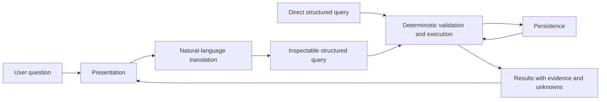
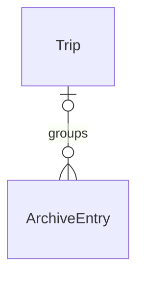

# Ride Archive

Adapted from [Michael Lynch’s article](https://refactoringenglish.com/excerpts/write-an-effective-design-doc/).

## Metadata

- Author: [DR, dimaryz@gmail.com]
- Created: September 16, 2026

## Objective

Make motorcycle ride data owned, structured, queryable across recording sources, and portable independently of any particular UI or AI provider.

## Background

Ride Archive is a personal ADV/enduro project for bringing motorcycle recording exports together and asking consistent questions across sources, bikes, dates, and places. Ownership, queryability, and reuse are the main value proposition.

## Related documents

- [Product brief](PRODUCT_BRIEF.md)
- [Six-step MVP project plan](PROJECT_PLAN.md)
- [Core data model draft — supporting fields and policies remain under review](docs/CORE_DATA_MODEL.md)
- [Query experiment](QUERY_EXPERIMENT.md)
- [Five-file corpus findings](analysis/CORPUS_FINDINGS.md)
- [Recording analysis and quality findings](analysis/FINDINGS.md)
- [Prototype README](prototype/README.md)

## Goals

- Bring GPX exports from different recording tools into a consistent personal archive with minimal manual input.
- Translate natural-language questions into inspectable structured queries, executed by a deterministic query layer.
- Keep structured querying and exporting usable without an LLM or a particular presentation client.
- Preserve original files, checksums, user context, provenance, and explicitly defined derived metrics.
- Support archive entries that combine recordings from an outing or represent supplied route references, with optional trip grouping.
- Keep source observations, user assertions, computed values, and enrichment/model suggestions distinguishable.
- Provide portable exports and restoration that preserve identities and supported semantics.
- Validate the complete import → query → inspect → export/restore workflow on newly imported data.

## Non-goals

- A generic personal-data platform or integration with Prerun Moto.
- General chat/agent behavior as the primary product interface.
- Automatic integrations and additional source formats in the initial GPX-first scope.
- Advanced trail matching and route-overlap analysis in the initial scope.
- Photos, journals, recaps, public sharing, billing, and hosted sync in the initial scope.
- Inferring missing dates, bike identity, terrain/difficulty, exact route completion, or actual moving time without supporting evidence.

## Scenarios

1. A rider imports recordings from different tools and adds bike or trip context where needed; original evidence and user-supplied facts remain distinguishable.
2. A rider combines multiple recordings associated with one outing into one ArchiveEntry, without implying that the recordings cover the entire outing.
3. A rider groups entries from multiple days using an optional trip_id. Tyee and Alder Creek can belong to the same rally trip even though their exact dates and ordering are unknown.
4. A rider asks a question, inspects its structured interpretation, and executes it to retrieve matching records and map results. Ambiguous or unsupported requests are surfaced explicitly.
5. A rider runs a structured query directly or exports/restores their data without requiring an LLM. Exact supported questions and expected results will be defined in project-plan step 2.

## Diagrams

Agreed logical responsibilities; deployment boundaries and API contracts remain to be designed.

Confirmed entry/grouping concept:

An ArchiveEntry represents an outing's recording or recordings, or a supplied route. It can have an optional trip_id. The fuller entity diagram and field definitions in the [core model draft](docs/CORE_DATA_MODEL.md) remain under review.

## Glossary

- **User**: The archive owner; one of the core objects identified for the model. Detailed account and authentication design is undecided.
- **ArchiveEntry**: One meaningful item in the archive: an outing's recording or recordings, or a supplied route reference. It need not represent a complete outing.
- **Source**: The original evidence behind an archive item. The current model draft represents a source as a preserved original file; detailed source structure is under review.
- **Trip**: A grouping of archive entries, associated through an optional trip_id. Detailed trip metadata remains under review.
- **Source observation**: Information present in imported evidence.
- **User context**: Context supplied by the rider, such as bike identity, participation, or trip membership.
- **Derived metric**: A computed value whose inputs, method, and version must remain identifiable.
- **Route reference**: Supplied geometry that can be associated with reported participation without claiming it is the rider's observed path.
- **Structured query**: An inspectable request validated and executed deterministically; natural language is one way to produce it.

## Constraints

- GPX-first, motorcycle ADV/enduro focus, minimal manual input, and a pragmatic solo-project scope with AI engineering learning value.
- Preserve original GPX bytes and checksums; corrections and enrichment must not erase the original evidence.
- Unknown information stays unknown. Missing dates or measurements must not become invented dates or measured zeros.
- Supplied route lengths must not become observed riding mileage. Recordings must not automatically imply complete outings.
- Support multiple recordings per outing and multiple tracks per file without forcing a one-file/one-entry assumption.
- Separate persistence, natural-language translation, deterministic execution, and presentation logically; this does not require separate deployed services.
- Complete query semantics and architecture/API contracts before general ingestion implementation, following the six-step project plan.
- Go, SQLite, and Svelte/TypeScript were selected on September 25, 2026, with Fly.io as the preferred hosting target. Model provider and geographic-query scope remain undecided.

## Interfaces

The agreed interaction is natural language → inspectable structured query → deterministic execution → matching records and map results. Direct structured queries must remain usable without AI. The translator targets the public query contract, and the executor revalidates both model output and direct input.

Presentation consumes stable application responses rather than database tables or storage-specific display data. Querying and export must remain independent of the presentation client. Ambiguous requests, unsupported requests, missing evidence, and empty results must be distinguishable.

Exports must include original files and versioned portable metadata, with provenance and metric methods. Restoration must preserve identities and supported semantics. Interoperable geometry alone is insufficient to preserve all original GPX information.

[UI sketches, API/CLI contracts, file formats.]

The initial core API is implemented and documented in the [API reference](docs/API.md) and [OpenAPI contract](docs/openapi.json). It supports owner-scoped trip/bike catalogs, unclassified entry creation and revision-checked edits, entry history, and original source preservation/download. GPX track/route parsing and revision-checked entry attachments are now implemented, including segment preservation and unlinking without source deletion. Evidence classification, metrics, query execution, and full export/restore remain pending in the new service.

## Dependencies / infrastructure

Confirmed September 25, 2026: **Go + SQLite + Svelte/TypeScript**, targeting Fly.io for low-cost hosting. One Go process serves the JSON API and the compiled frontend. The initial deployment shape is one Machine with a persistent volume.

The backend uses net/http, database/sql, modernc.org/sqlite, and embedded versioned SQL migrations. The client uses Svelte 5, TypeScript, and Vite. Lockfiles pin dependencies. The new database is separate from the Python PoC; original files are stored as immutable BLOBs for transactional preservation in this first slice. The [stack decision](docs/STACK_PROPOSAL.md) records alternatives and cost/operational tradeoffs; the [README](README.md) contains local run and deployment instructions.

## Security

The query executor validates both direct structured input and model-generated requests. Natural-language translation targets a defined query contract rather than arbitrary SQL. Model output must not grant access; trusted ownership context and authentication/authorization boundaries must be defined if hosted access is chosen.

[Threats, entry points, trust boundaries, mitigations.]

Initial implementation: local mode binds to loopback and checks Host headers. Non-loopback startup requires a personal bearer token, and all API routes require it when configured. The owner is selected by server configuration, not request bodies. Same-owner associations are enforced in SQLite; cross-origin writes are rejected. The client keeps the token only in memory. This is single-owner access, not multiuser authentication. No hosted app has been provisioned.

## Privacy

[Sensitive data, retention, access, protection.]

## Legal considerations

[Regulations, contracts, licensing.]

## Logging

[Events, severity, storage, retention, access, redaction.]

## Open issues

- Problem: Supporting domain fields, cardinalities, and policies are still proposals, including Bike, provenance records, path attachments, duplicate handling, and aggregation of overlapping recordings.
- Options: Review the [core model draft](docs/CORE_DATA_MODEL.md), including one bike per entry, whole-path attachment, and whether a separate Ride entity will be needed for outing counts.
- Next step: Complete the step 1 model review using the five real examples and explicit edge cases.

- Problem: Supported questions, query result units, null semantics, spatial/aggregate scope, and evaluation thresholds are not finalized.
- Options: Assess realistic questions against available evidence and explicitly distinguish supported, clarification, and unsupported outcomes.
- Next step: Build the 20–30-question acceptance corpus and versioned query-language draft in step 2.

- Problem: Hosted backup/restore, final authentication, model provider, and ingestion/query contracts remain undecided.
- Options: Begin with a single-owner Fly deployment, a persistent SQLite volume, and independent backups; reconsider Postgres/PostGIS if geographic requirements or multiple writers justify it.
- Next step: Define and test independent recovery, confirm spatial semantics, and complete ingestion/query contracts before general ingestion and deployment.

- Problem: Recurring user value, import friction, and willingness to pay remain unvalidated.
- Options: Validate independent use on a larger personal corpus before making monetization commitments.
- Next step: Follow the MVP acceptance work in the project plan.

## Resolved issues

- Decision: Use Go, SQLite, and Svelte/TypeScript; serve the API and compiled frontend together, with Fly.io as the preferred hosting target.
- History: Confirmed by the user on September 25, 2026 after comparing Go/Rust and SQLite/Postgres. The initial foundation now implements metadata APIs and source preservation; deployment and backup automation remain pending.

- Decision: The product is named Ride Archive and centers on ownership, consistent structure, querying, and portability.
- History: The product brief records this direction as confirmed; a working map/list prototype alone did not establish sufficient value.

- Decision: Natural language translates to an inspectable structured query. Deterministic execution and replaceable presentation are separate responsibilities, and querying/export must work independently of AI.
- History: The product brief and six-step project plan establish this separation; the PoC provides a foundation rather than the final architecture.

- Decision: ArchiveEntry is one meaningful archived item, can combine recordings associated with an outing or represent a supplied route, and has an optional trip_id.
- History: Confirmed by the user during the initial core data model discussion. Supporting fields and policies were left as proposals.

- Decision: Preserve distinctions between original observations, user assertions, deterministic derivations, and enrichment/model suggestions; do not treat supplied route length as measured riding distance.
- History: The five sample files include partial recordings, recorder/exporter differences, quality anomalies, and untimestamped supplied routes with user-reported participation.

- Decision: Proceed through domain design, query semantics, architecture/contracts, ingestion/portability, query/NL implementation, and client/end-to-end validation.
- History: The six-step project plan supersedes the earlier experiment implementation sequence.
