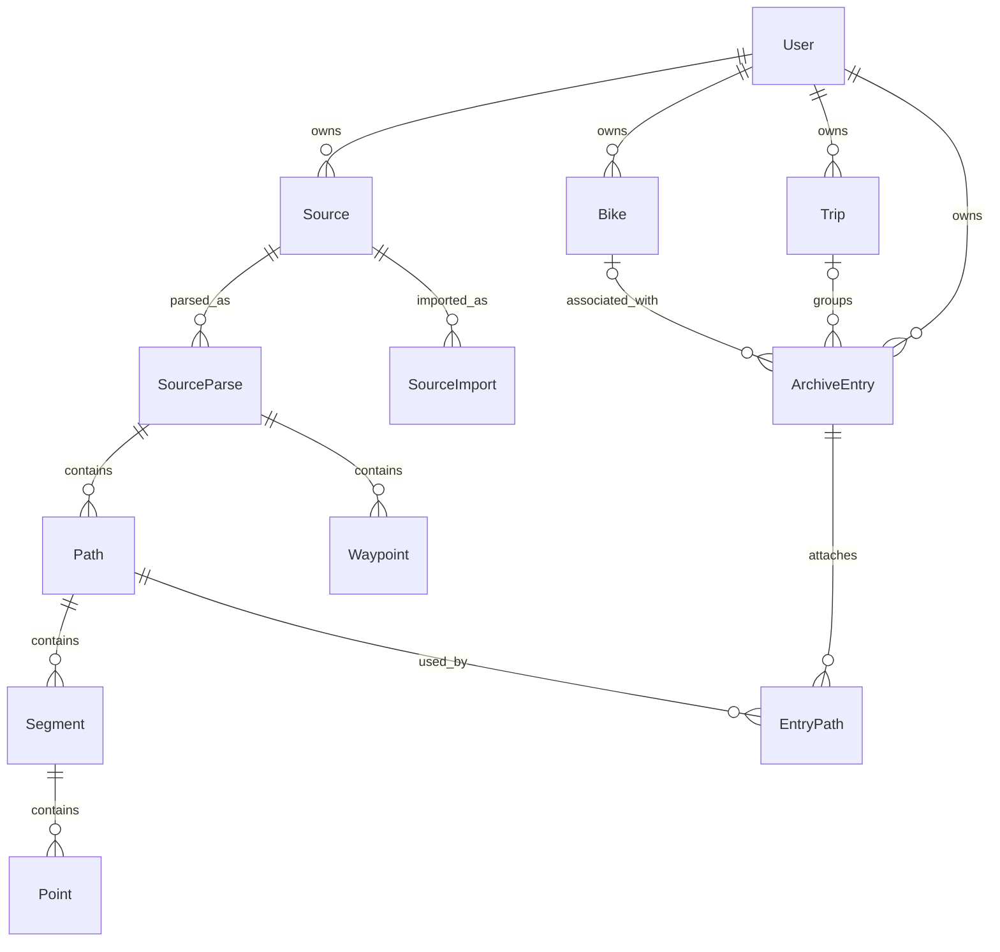

# Core data model — first design draft

September 15, 2026 · Step 1 of [PROJECT_PLAN.md](../PROJECT_PLAN.md)

Status: proposed for discussion. This defines domain objects and logical relationships; it does not select a database or change the running PoC.

Confirmed in discussion: ArchiveEntry is one meaningful archived item, can combine recordings from an outing or represent a supplied route, and has an optional trip_id. Supporting fields and policies below remain proposals.

## Core proposal

Start with **User, ArchiveEntry, Source, Trip, and Bike**. ArchiveEntry is the item a person organizes, queries, annotates, and exports. Source preserves the original evidence behind that item. Trip groups entries through an optional `ArchiveEntry.trip_id`.

An entry represents a recording or collection of recordings associated with an outing, or a supplied route reference. It does not guarantee a complete ride. Multiple recordings can belong to one entry when the user identifies them as the same outing. Imported tracks should not be automatically combined just because their dates or locations are close.

Use `kind = recorded | route_reference | unclassified`. A route reference can carry the user's report that they rode it without turning its geometry into an observed recording. Keep a separate Ride entity deferred: the current samples do not need another mandatory layer between entries and trips. If repeated participation, outing counts, or mixed route/recording evidence becomes central, revisit this before defining those queries.

## Domain glossary and logical schema

IDs are opaque, stable, portable identifiers, independent of names, filenames, array positions, and file hashes. `?` means optional. Mutable top-level records carry `created_at`, `updated_at`, and a revision. Import time is never a ride date.

| Object | Meaning and principal fields |
|---|---|
| **User** | Archive owner: `id`, `display_name?`, `display_timezone?`, `unit_preference?`. A local installation can have one user without a login. Authentication identity is an architecture concern. |
| **ArchiveEntry** | Organized archive item: `id`, `owner_id`, `title`, `kind`, `trip_id?`, `bike_id?`, `reported_date?`, `participation = reported_ridden | reported_not_ridden | unknown`, `recording_coverage = partial | complete | unknown`. Mutable factual fields reference their provenance records. |
| **Source** | One immutable original file: `id`, `owner_id`, `sha256`, `byte_length`, `media_type`, `original_blob_ref`. Source means the preserved artifact, not the app or device. |
| **SourceImport** | An import occurrence: `id`, `source_id`, `original_filename`, `imported_at`, `import_channel?`. Keeps filename/history when the same bytes are imported again. |
| **Trip** | A named group: `id`, `owner_id`, `name`, `reported_date?`, `notes?`. Membership does not imply complete coverage, sequence, or continuous riding. |
| **Bike** | A user-owned catalog record: `id`, `owner_id`, `name`, `make?`, `model?`, `model_year?`, `aliases[]`. Archiving a bike retains historical associations. |
| **SourceParse** | A versioned interpretation of a source: `id`, `source_id`, `parser_name`, `parser_version`, `status`, `issues[]`. Reprocessing creates a new parse; existing links remain pinned until deliberately migrated. |
| **Path** | A GPX track or route from one parse: `id`, `parse_id`, `source_locator`, `structure = gpx_track | gpx_route`, `embedded_name?`, `evidence_kind = observed | reference | unknown`, with classification provenance. GPX track syntax alone does not imply a recording. |
| **Segment** | An ordered part of a path: `id`, `path_id`, `ordinal`. Preserve GPX track segment boundaries. A GPX route uses one logical segment explicitly marked as normalized structure. |
| **Point** | Ordered source sample: `segment_id`, `ordinal`, `latitude`, `longitude`, `elevation_m?`, `timestamp?`, `raw_time?`, `source_locator`. Identity is the segment plus ordinal; source order is preserved. |
| **Waypoint** | Independent named GPX point: `id`, `parse_id`, `source_locator`, coordinates, optional name/elevation/time. It is not silently inserted into a path. |
| **EntryPath** | Evidence attachment: `id`, `entry_id`, `path_id`, `role = primary | supplemental | alternative`, `sequence?`, `provenance_id`. The role helps organize evidence; it does not authorize summing overlapping recordings. |
| **Annotation** | User note or label: `id`, `owner_id`, `target`, `type = note | tag`, `value`, `provenance_id`. Tags are freeform labels; trips have stable identity. |
| **Provenance** | Origin of an assertion/field: `id`, `owner_id`, `target`, `field`, `value`, `origin = source | user | enrichment`, `source_locator?`, `source_id?`, `actor_id?`, `provider?`, `method_version?`, `recorded_at`, `status = proposed | accepted | superseded`, `supersedes_id?`. |
| **DerivedMetric** | A computed result: `id`, `owner_id`, `target`, `name`, `value?`, `unit`, `status = available | insufficient_data | not_applicable | failed`, `method`, `method_version`, `parameters`, exact input references/revisions, `computed_at`, `quality_issue_ids[]`. |
| **QualityIssue** | A finding with scope: `id`, `owner_id`, `target`, `code`, `severity`, `details`, `detector_version`, exact input references. A flagged edge can be addressed by its two point identities. |

`target` is a validated typed reference, not an arbitrary string: annotations target entries/trips/bikes; provenance can additionally target sources, paths, and evidence links; metrics/issues can target paths, segments, entries, or trips. Child ownership follows the parent. Physical foreign keys and indexes are step 3 decisions.

The selected value of a factual field and its accepted provenance must change together. Corrections retain superseded assertions. Conflicting source facts remain inspectable; an enrichment or model suggestion stays proposed until accepted. DerivedMetric stores deterministic derivation provenance separately instead of masquerading as a user/source assertion. File metadata such as GPX creator is stored as a source fact with a locator; recorder identity may instead be a user assertion on a path.

## Relationships

- An entry belongs to exactly one owner, zero or one trip, and zero or one bike in this MVP proposal. Multi-bike outings require separate entries for now.
- A trip has zero or more entries. A small Trip object gives the group a name and context; `trip_id` is sufficient for membership. No generic group hierarchy or trip membership table is needed yet.
- Entries and paths have a many-to-many relationship. One file may contain unrelated tracks; one entry may draw from several files. A reference path may be reused by entries for different occasions.
- An entry can have no paths while awaiting evidence or classification. An entry classified `recorded` requires at least one observed path; a `route_reference` requires a reference path. Failed imports preserve sources without creating misleading recorded entries.
- Sources and entries never share an identity by requirement. An entry's sources are obtained through its attached paths and supporting provenance.
- Sequence is optional. Source ordering is technical ordering, not the date/order of an outing. For split outings within one path, MVP attachment remains whole-path; point-range attachment is deferred and must be designed before claiming support for that split.

## Dates, assertions, and metrics

`reported_date` is a precision-bearing value such as `{value: "2025", precision: "year"}`, `{value: "2026-09", precision: "month"}`, or `{value: "2026-09-05", precision: "day"}`, backed by user provenance. Unknown is null. Trip dates may also be explicit ranges of such values. A reported year is never persisted as January 1 or as a measured start timestamp.

Observed time bounds come from timestamped path samples and retain input references and coverage information. Preserve explicit UTC offsets and raw source time text; normalize valid instants for comparison. Offset-free times stay unresolved unless an explicit timezone interpretation is supplied with provenance. Display timezone does not become evidence about where the rider was.

No single ambiguous `distance` or `duration` field belongs on an entry:

| Metric | Owner/input | Meaning |
|---|---|---|
| `raw_recorded_distance_m` | Observed path | Sum adjacent-coordinate distances within each segment; explicitly declare gap policy. Not odometer mileage. |
| `reference_length_m` | Reference path | Supplied geometry length. Never measured riding distance. |
| `timestamp_span_s` | Path with valid time evidence | Span between valid bounds; not moving time or necessarily complete outing duration. Partial timestamps must be disclosed. |
| `moving_time_estimate_s` | Observed path | Optional later result with threshold/gap policy, method version, and quality limits. |
| Entry/trip aggregate | Explicit selected input paths/metrics | Only available under a documented inclusion and overlap policy. Otherwise unavailable with a reason. |

Every result records units, method version, parameters, inputs, and quality state. Absence of a metric is not zero. Absence of a quality issue is not proof a detector ran successfully. Raw coordinate distance can exist without timestamps; time-dependent metrics cannot.

For overlapping recordings, retain both paths and allow choosing a primary path. Do not add distances or durations by default. Supplemental paths also need explicit composition rules before aggregate metrics are computed. Cross-entry and trip aggregation must account for reused paths and overlapping evidence as well; summing displayed entry numbers is insufficient. Reference geometry is always excluded from recorded mileage.

## Invariants and edge cases

1. All references remain within one owner, including trip/bike membership, paths, annotations, and provenance. Owner context comes from trusted application context, never an NL query payload.
2. Original bytes and hashes are immutable. User corrections edit assertions or create new interpretations; they do not rewrite the original file.
3. Byte-identical imports for the same owner reuse the source using `(owner_id, sha256)`, verifying length/bytes on collision. Preserve another SourceImport occurrence but do not automatically create another entry. Intentional entry creation remains possible for repeated use of a route.
4. Different bytes with similar geometry are possible duplicates, not automatically interchangeable files. Keep both until the relationship is resolved; never deduplicate solely by title/date.
5. GPX `trk` and `rte` structure is distinct from observed/reference meaning. The two rally routes are GPX tracks but reference evidence. Unknown classification remains visible until resolved.
6. Preserve all segment boundaries and source ordering. Do not create connecting edges between segments. Invalid samples are retained in the original with parse issues; normalized calculations must identify exclusions and must not silently bridge an invalid sample.
7. Missing or non-increasing timestamps produce explicit limitations, not invented times or silently reordered points. Import supports incomplete evidence.
8. Reporting that a route was ridden does not establish exact-path completion, a date, measured mileage, or duration. Repeating that route on another occasion can create another entry using the same reference path; an entry is not automatically a distinct verified outing count.
9. Hells Canyon's partial recording does not create a fictitious second-day entry. An intentionally open-ended recording is not automatically marked incomplete because its endpoints differ.
10. Removing an entry removes its associations, not shared source evidence. Destructive source deletion requires explicit handling of dependent evidence. Removing a trip can clear membership while retaining entries. Precise deletion/recovery behavior belongs in the API design.

## Mapping the five real files

The mapping below uses existing IDs as human-readable aliases, not proposed ID generation rules. Each original currently has one track and one segment. All five sources retain their exact bytes and hashes from `analysis/corpus.json`.

| Entry alias | Source → path | Entry facts | Trip | Metric/evidence limitations |
|---|---|---|---|---|
| `hells` | `hells-canyon-day1.gpx` → observed path, 4,737 points | Recorded; KTM 890; user reports onX recorder and partial day 1; timestamp evidence on September 5, 2026 in Pacific display time | `hells-canyon-2026` | 132.6 mi raw path distance; timing/location anomalies and long gaps retained; no full-trip mileage. Source creator: onXmaps offroad web. |
| `kittitas` | `kittitas-county-dirt-bike.gpx` → observed path, 6,034 points | Recorded; TE 300; user reports Garmin watch; timestamp evidence on July 25, 2026 in Pacific display time | None known | 14.4 mi raw path distance. Source creator: GaiaGPS. Intentional different start/end points do not establish partial coverage. |
| `tyee` | `08-tyee-2025.gpx` → reference path, 8,866 points | Route reference; KTM 890; participation reported ridden; reported year 2025 | `touratech-rally-2025` | 120.4 mi reference length; all timestamps absent. Actual date/path/duration/mileage unknown. Source creator: GaiaGPS. |
| `alder` | `11-alder-creek-2025.gpx` → reference path, 1,616 points | Route reference; KTM 890; participation reported ridden; reported year 2025 | `touratech-rally-2025` | 28.0 mi reference length; all timestamps absent. Different day from Tyee is user context, retained as a trip note; order unknown. Source creator: GaiaGPS. |
| `evans` | `evans-300.gpx` → observed path, 4,989 points | Recorded; TE 300; user label Evans Creek OHV; timestamp evidence on September 21, 2024 in Pacific display time | None known | 14.4 mi raw path distance. Recorder unknown; source creator GaiaGPS. One recording is not evidence of total visit count. |

This gives one User, five Sources, five initial SourceImports/SourceParses/Paths/Segments/ArchiveEntries/EntryPaths, two Trips, and two Bikes. Point counts total 26,242. No separate Ride records or inferred dates are required. Keep existing metric calculations as historical derivations with their existing method versions; this proposal does not validate or correct them.

Additional cardinality examples:

- Phone plus Garmin recordings of the same outing: two sources, two paths, one entry, two attachments; primary/alternative selection and no automatic summed mileage.
- One file containing tracks for two days: one source, two paths, two entries in one trip after the user confirms their grouping. No requirement to duplicate source bytes.
- The same rally reference used on a later trip: reuse its source/path, create a separate entry with the new trip and independently asserted participation/date/bike.

## Ownership, export, and evolution

A complete export includes owner identity, entries, trips, bikes, sources/original bytes, import and parse metadata, full normalized geometry, annotations, accepted and superseded assertions, metric inputs/methods, and quality findings. Storage paths are replaced by portable archive member references. Authentication secrets are not archive content.

A selected-entry export includes the dependency closure needed to interpret those entries, including shared original files and linked trip/bike metadata. Shared originals can contain tracks outside the selection; disclose that behavior instead of calling a full original an exact selected-geometry export. Include partial-trip scope so a selected export does not imply all trip entries were included. An additional filtered geometry export can be offered, with its loss of original fidelity documented.

Restore preserves IDs, relationships, bytes/hashes, units, date precision, assertions, and method versions. Conflicting existing IDs must fail or use an explicit consistent remapping policy; they must never silently overwrite unrelated records. Validate references and provenance dependencies before committing.

Version the portable format separately from database migrations, parsers, and metric algorithms. Unknown required fields or enum semantics should fail clearly; optional extension fields should survive round trips. Reprocessing can supersede metrics and parses without erasing how previous answers were obtained. Changes to evidence links invalidate dependent aggregate metrics.

The PoC currently couples `entries.id` to `sources.id`, embeds presentation data, and keeps one flattened metric set. A later migration must separate those identities, create evidence links, retain existing provenance, and support old export version 1 through an explicit importer. Do this after steps 2–3 resolve query and storage contracts.

## Review points before finalizing step 1

- Is one optional trip and bike per entry enough for the MVP? This draft assumes yes.
- Are whole-path attachments sufficient initially? Splitting a multi-day single path needs additional selection semantics.
- Step 2 must distinguish entry counts from outing counts and define primary/supplemental evidence aggregation before claiming ride totals.

The draft covers the five samples and core edge cases. Step 1 remains under review until these product choices are settled; physical schema and implementation follow the plan's architecture step.
